## 🚀一、项目介绍
在现代Web应用中，用户经常需要上传大量文件，但传统的上传方式在面对大文件或不稳定网络环境时，常常导致上传失败或中断，用户体验较差，这个项目实现基于.NET8+Vue3文件存储前端后端的案例，支持文件上传的高级特性`断点续传`、`秒传`、`取消`、`暂停`、`恢复`等

## ✈️二、主要技术栈
#### 后端：
- [.NET8](https://learn.microsoft.com/zh-cn/aspnet/core/getting-started/?view=aspnetcore-8.0)
- [EntityFramework Core](https://learn.microsoft.com/zh-cn/ef/core/)
- [Quartz](https://www.quartz-scheduler.org/)
- [Minio](https://min.io/)
- [Redis](https://redis.io/)
  
#### 前端

- [Vue3.4](https://cn.vuejs.org/)
- [Typescript](https://www.tslang.cn/index.html)
- [Vite](https://cn.vitejs.dev/)
- [Pinia](https://pinia.vuejs.org/zh/introduction.html)
- [Vue-Router](https://router.vuejs.org/zh/introduction.html)

## 🚁三、项目如何配置启动？（详细）
先决条件: 已经安装.NET8 SDK, Node.js
#### 1. 使用cmd或者powershell进入项目根执行以下命令
````c#
# 安装依赖
dotnet restore
# 更新生成数据库
dotnet ef Database Update --project ./samples/FileStorage.Api/FileSt
orage.Api.csproj
````

#### 2. 运行redis
下载和运行过程省略...
#### 3.下载Minio并运行
windows版本下载地址
https://dl.minio.org.cn/server/minio/release/windows-amd64/minio.exe

在minio.exe所在目录运行以下命令 <b>(运行后不要关闭命令窗口)</b>
````powershell
minio.exe server ./Data --console-address ":9001"
````

运行成功后会在minio.exe 的同级目录创建Data文件夹
#### 4. 配置minio
浏览器进入 http://localhost:9001 账户和密码默认均为minioadmin （可以在命令行看到）

- <b>4.1创建桶
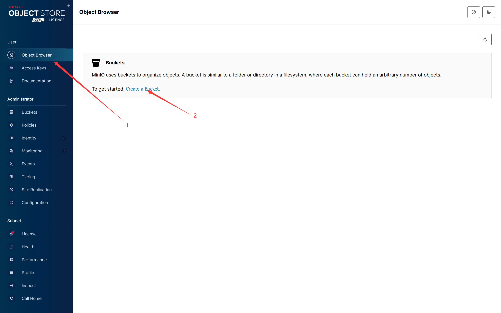
（注意：需要记录桶名称一会用）
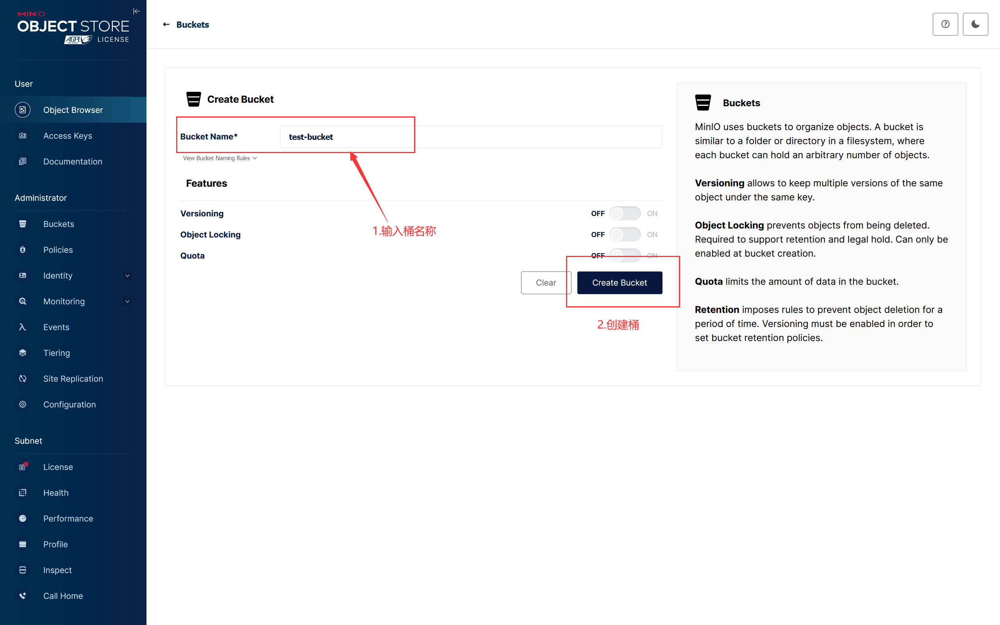

- <b>4.2配置桶的访问策略
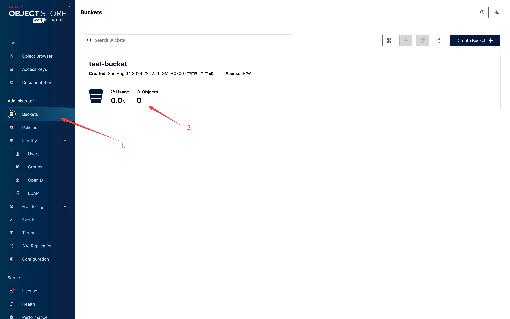
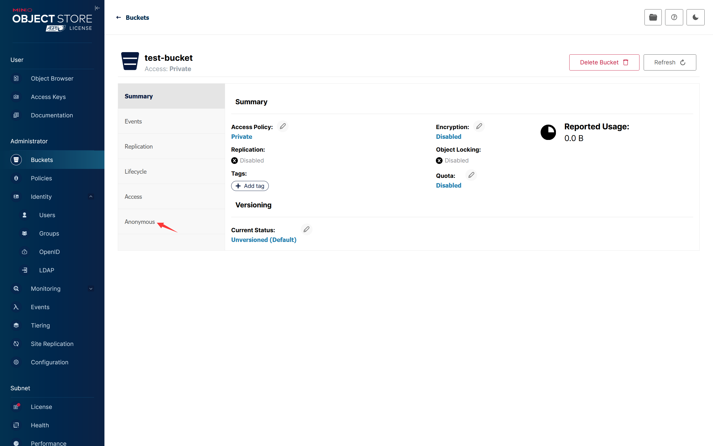
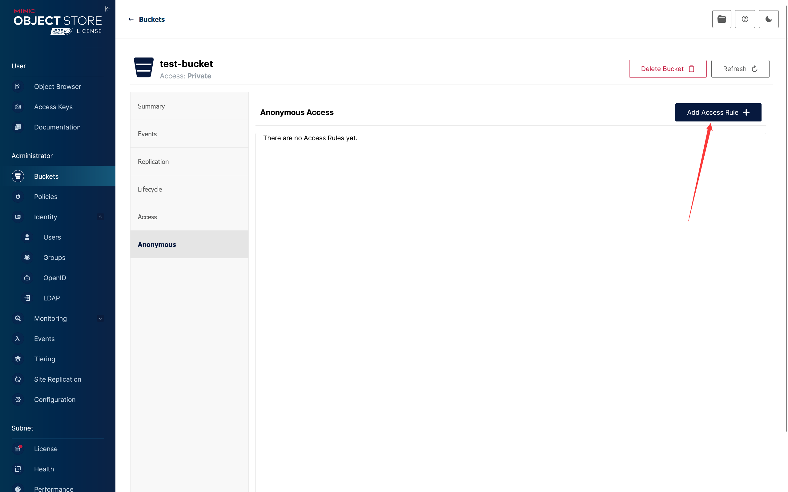
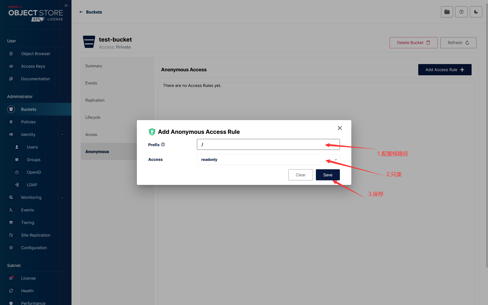

- <b>4.3配置访问令牌
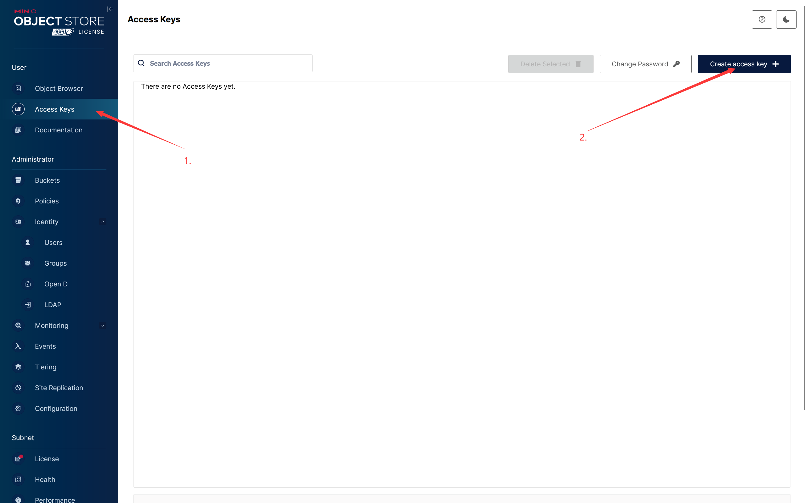
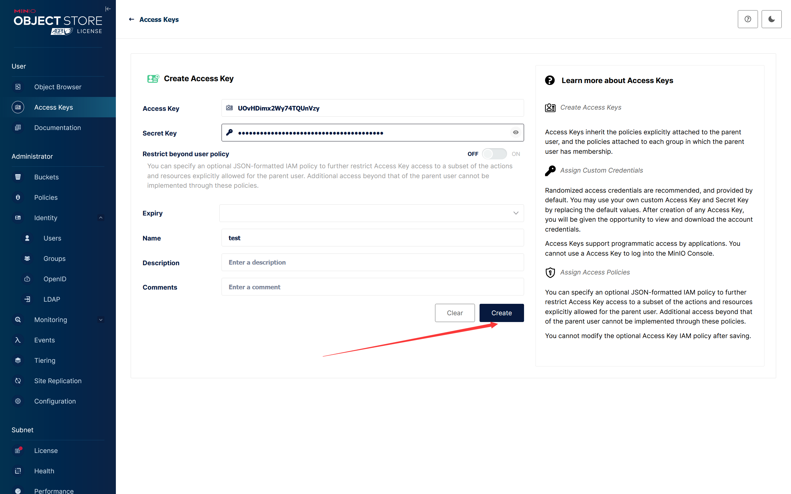
（注意：保存好AccessKey和SecretKey一会用）
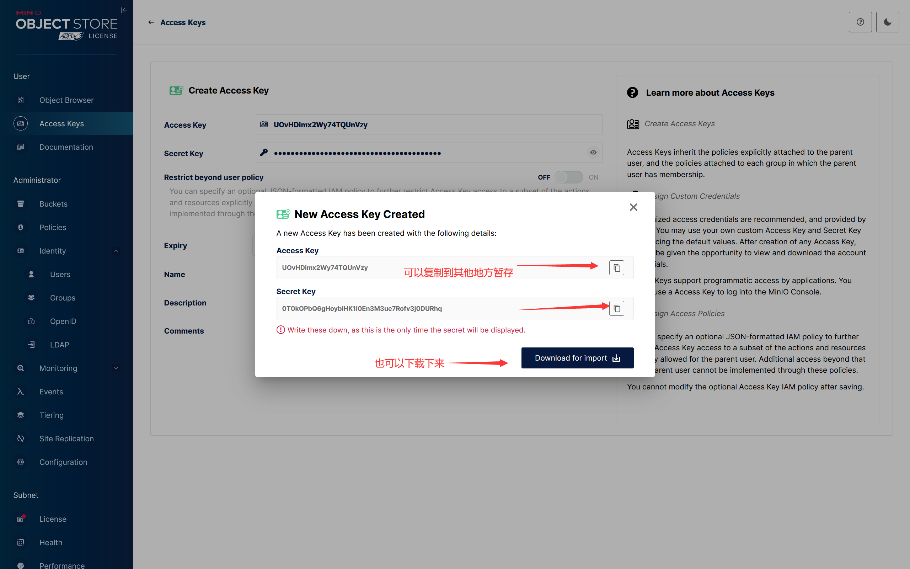
#### 5.配置后端项目
- <b>5.1配置minio</b><br>
进入到`FileStorage.Api`项目的`Program.cs`中
填充4.1和4.3记录的minio的配置
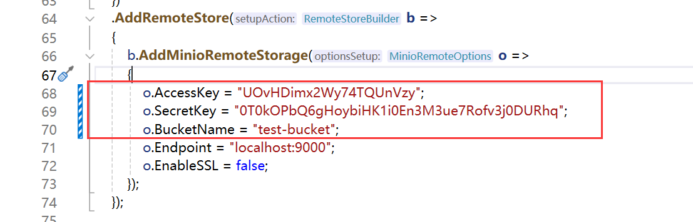
- <b>5.2配置redis</b><br>
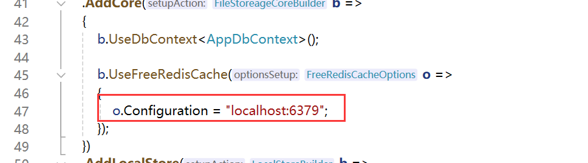
配置好在根目录运行 
````
dotnet run --project ./samples/FileStorage.Api/FileStorage.Api.csproj
````
至此后端部分已经完成配置与启动
#### 6.配置前端项目
6.1 全局安装pnpm(可能需要管理员打开cmd/powershell)
````powershell
npm install -g pnpm
````
6.2 命令行或powershell进入目录 samples/Client
````powershell
#安装依赖
pnpm instal
#运行
pnpm run dev
````

## 🌈四、截图
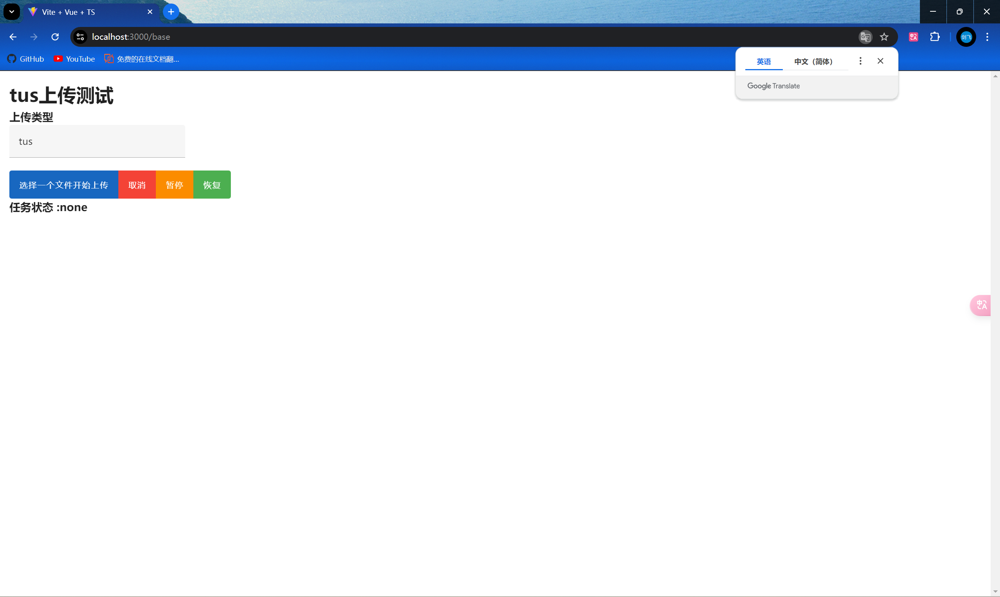
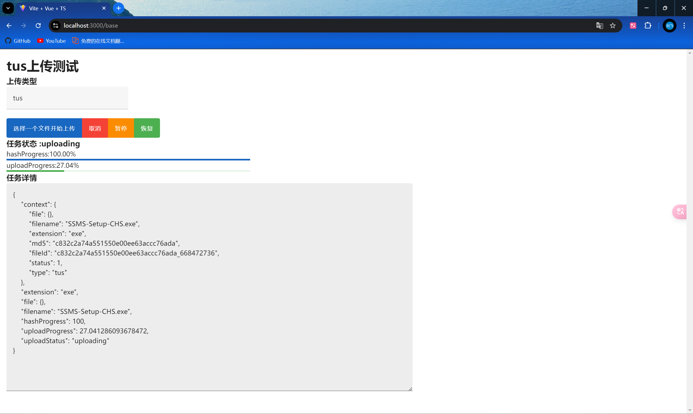
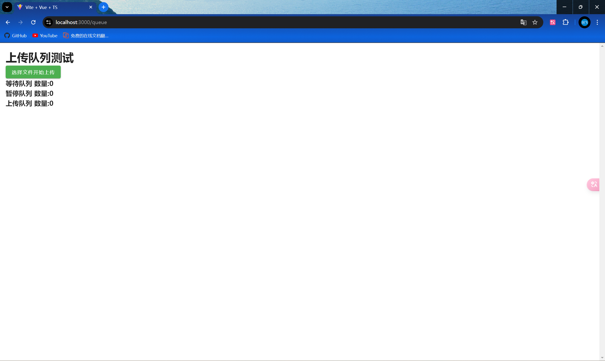
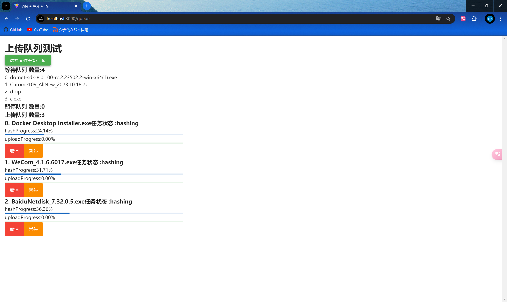

## 🎉加入我们
欢迎加入我们的.net qq交流群 737776595

